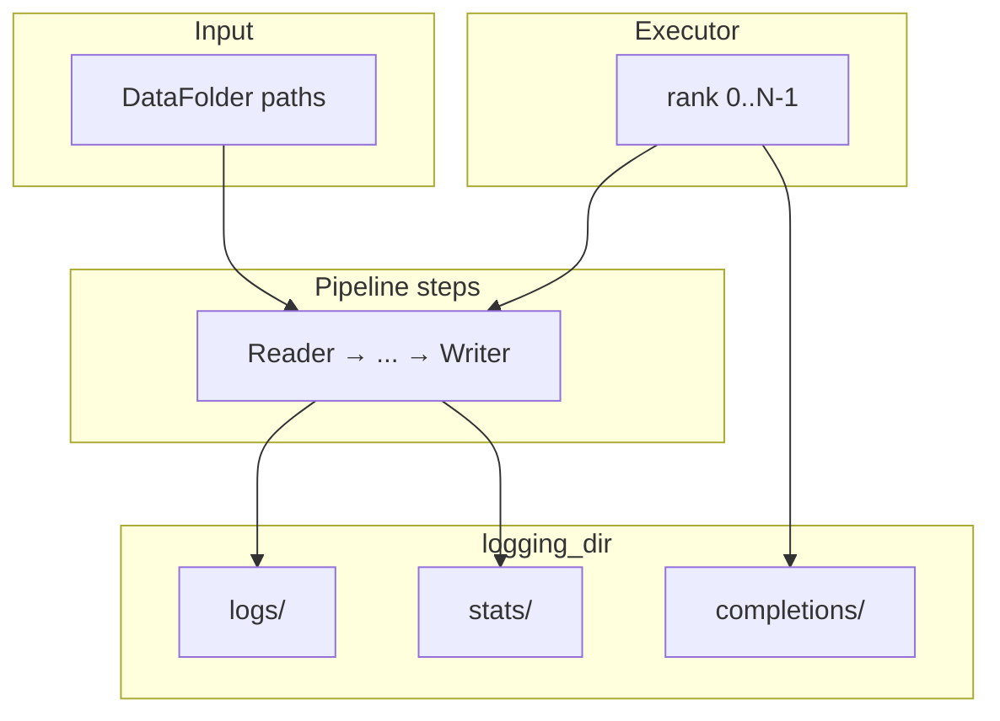

# DataTrove

Large-scale text processing library: read → transform → filter/dedup/tokenize/infer → write. Pipelines run locally, on Slurm, or on Ray via composable `PipelineStep` blocks.

For dev commands, code style, and contribution rules, see [AGENTS.md](AGENTS.md). For deep context on a specific area, open the `CLAUDE.md` in that directory (10 files, listed below).

## Execution model

1. **Executor** (`LocalPipelineExecutor`, `SlurmPipelineExecutor`, or `RayPipelineExecutor`) launches `tasks` workers with `(rank, world_size)`.
2. **Pipeline** is an ordered list of blocks; each block's `run()` yields `Document` generators.
3. **`logging_dir`** stores per-rank logs, stats JSON, and completion markers — one unique directory per pipeline run.

## Core data model and I/O (`src/datatrove/data.py`, `io.py`)

**`Document`.** Universal pipeline unit: `text`, `id`, `media[]`, `metadata{}`. Uses `slots=True`; mutable fields use `field(default_factory=...)`. Extractors, formatters, filters, and inference mutate `text` or `metadata` in place; writers serialize current state.

**`DocumentsPipeline`.** `Generator[Document, None, None] | None` — first pipeline step receives `None`.

**`Media` / `MediaType`.** Used by `pipeline/media/`; `MediaType` constants exist but are largely unused today.

**`DataFolder`.** fsspec wrapper: list files, read/write, `get_shard(rank, world_size)` via `all_files[rank::world_size]`. Path schemes: local, `s3://`, `hf://datasets/...`, `hf://buckets/...`. Factory: `get_datafolder()`.

**Other I/O helpers.** `get_shard_from_paths_file`, `safely_create_file` (local lock), `cached_asset_path_or_download`, `OutputFileManager` (used by writers).

**Pitfalls:** Empty input folder → `get_shard` returns `None`. Glob patterns without magic get `*` prepended. Changing `Document` fields is a breaking change. Stats flow: `stat_update` → `stats/{rank:05d}.json` → optional `merge_stats` CLI.

## Examples vs library

[`examples/`](examples/) are production-style templates with placeholder S3/Slurm paths. They import blocks from [`src/datatrove/`](src/datatrove/) and demonstrate multi-job `depends=` chains. Not runnable without replacing paths, credentials, and partition names.

## CLAUDE.md index (10 files)

| Path | Scope |
|------|-------|
| [AGENTS.md](AGENTS.md) | Global dev guide |
| [examples/CLAUDE.md](examples/CLAUDE.md) | All example scripts incl. inference & benchmark |
| [src/datatrove/utils/CLAUDE.md](src/datatrove/utils/CLAUDE.md) | Helpers, assets, hashing, CLI tools, `fast_mh3` |
| [src/datatrove/executor/CLAUDE.md](src/datatrove/executor/CLAUDE.md) | Local / Slurm / Ray executors |
| [src/datatrove/pipeline/CLAUDE.md](src/datatrove/pipeline/CLAUDE.md) | `PipelineStep`, extractors, formatters, stats, tokens, media |
| [src/datatrove/pipeline/readers/CLAUDE.md](src/datatrove/pipeline/readers/CLAUDE.md) | Input readers |
| [src/datatrove/pipeline/writers/CLAUDE.md](src/datatrove/pipeline/writers/CLAUDE.md) | Output writers |
| [src/datatrove/pipeline/filters/CLAUDE.md](src/datatrove/pipeline/filters/CLAUDE.md) | Quality / language filters |
| [src/datatrove/pipeline/dedup/CLAUDE.md](src/datatrove/pipeline/dedup/CLAUDE.md) | Dedup + decont |
| [src/datatrove/pipeline/inference/CLAUDE.md](src/datatrove/pipeline/inference/CLAUDE.md) | LLM inference, servers, Ray |

## Cross-cutting pitfalls (repo-wide)

- Set **`tasks` ≤ number of input files** for disk readers; never change `tasks` on partial relaunch.
- Use a **fresh `logging_dir`** per pipeline run.
- Include **`${rank}`** in writer output filenames.
- Install **optional extras** (`uv sync --extra io`, `--extra inference`, etc.) before running related examples.
